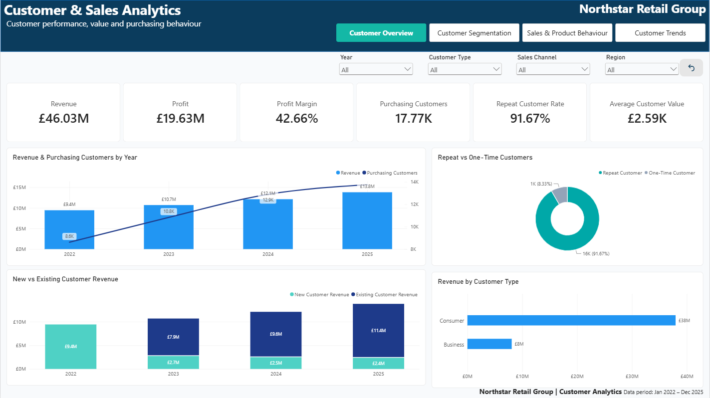
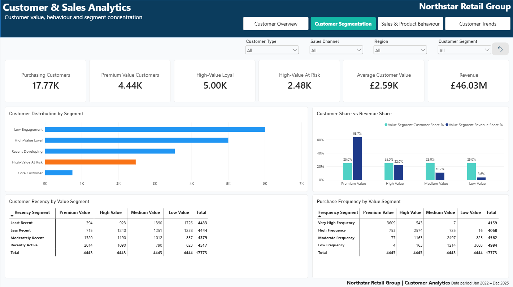
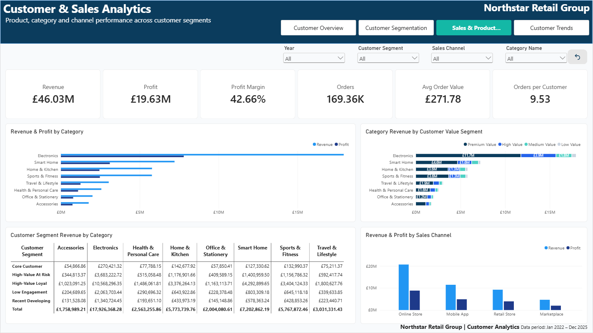
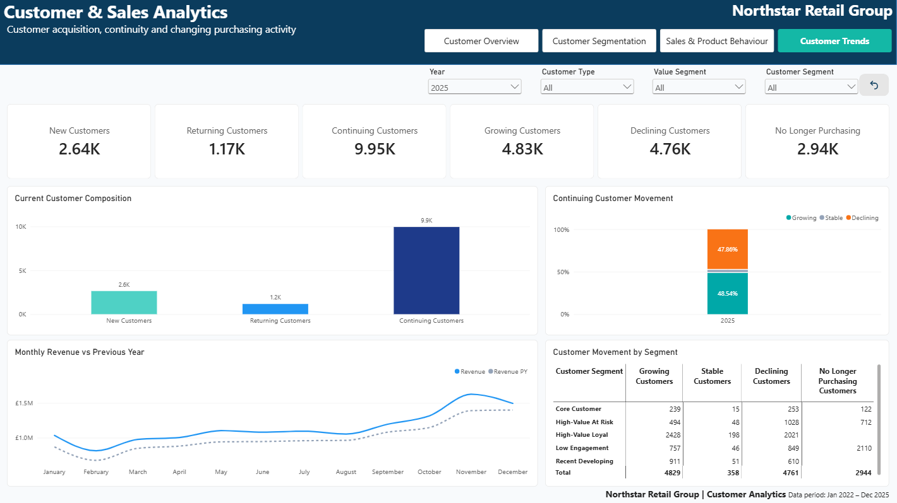

# Customer & Sales Analytics

## Power BI \| SQL \| DAX \| Star Schema \| Customer Analytics

A portfolio project demonstrating an end-to-end customer and sales
analytics solution built with **SQL Server and Power BI**.

The project moves beyond standard sales reporting to analyse **customer
value, repeat purchasing, acquisition, segmentation, product behaviour
and year-over-year customer movement** using a large realistic
transactional dataset.

------------------------------------------------------------------------

## Project Overview

Northstar Retail Group is a fictional UK omnichannel consumer retailer
operating across:

-   Online Store
-   Marketplace
-   Retail Stores
-   Mobile App

The business needed a clearer understanding of which customers generate
value, how customer groups behave, what they purchase and how their
purchasing activity changes over time.

The solution transforms raw transactional data into a validated SQL
analytical layer, a Power BI star schema and an interactive four-page
customer analytics report.

------------------------------------------------------------------------

## Business Questions

The project was designed to answer questions including:

-   Who are the most valuable customers?
-   Which customers generate the highest revenue and profit?
-   How frequently do customers purchase?
-   How much revenue comes from repeat customers?
-   How does customer value differ across segments?
-   Which products and categories are associated with different customer
    groups?
-   Which customers are growing or declining year over year?
-   Which previous-year customers recorded no completed purchase in the
    current year?

------------------------------------------------------------------------

## Technology Stack

  -----------------------------------------------------------------------
  Technology                          Use
  ----------------------------------- -----------------------------------
  SQL Server / SSMS                   Database creation, raw loading,
                                      data quality, transformation and
                                      analytical modelling

  Power BI Desktop                    Semantic model, DAX, visualisation
                                      and interactive reporting

  DAX                                 KPIs, customer behaviour,
                                      acquisition, segmentation and trend
                                      analysis

  Power Query                         Data connection and model
                                      preparation

  Git / GitHub                        Version control and portfolio
                                      documentation
  -----------------------------------------------------------------------

------------------------------------------------------------------------

## Dataset

The project uses a realistic synthetic retail dataset covering:

**1 January 2022 -- 31 December 2025**

  Dataset Component          Scale
  ---------------------- ---------
  Registered Customers      20,000
  Products                     500
  Categories                     8
  Orders                   180,000
  Order Lines              450,000
  Completed Orders         169,360
  Purchasing Customers      17,773

The raw customer source intentionally included **12 exact duplicate
records** and other controlled data-quality conditions so that
validation and cleaning formed part of the analytical workflow.

------------------------------------------------------------------------

## Commercial Transaction Treatment

The primary analytical model uses **Completed orders only** for realised
sales KPIs.

-   Completed --- included in realised Revenue, Cost, Profit, Quantity
    and Orders
-   Returned --- retained in the raw layer but excluded from primary
    realised-sales KPIs
-   Cancelled --- retained in the raw layer but excluded from primary
    realised-sales KPIs

This rule is applied consistently throughout the SQL analytical layer
and Power BI model.

------------------------------------------------------------------------

## Solution Architecture

``` text
Raw CSV Files
      ↓
SQL Raw Layer
      ↓
Data Quality Validation
      ↓
SQL Analytical Layer
      ↓
Dimensional Star Schema
      ↓
Power BI Semantic Model
      ↓
DAX Customer Analytics
      ↓
Interactive Power BI Report
      ↓
Validated Business Insights
```

------------------------------------------------------------------------

## Dimensional Model

The Power BI semantic model follows a clean **star schema**.

``` text
                    DimCustomer
                         |
                         |
DimProduct --------- FactSales --------- DimDate
                         |
                         |
                    DimChannel
```

`FactSales` grain:

> One row per completed order line --- one product purchased by one
> customer as part of one order.

Core relationships are **1:\* single-direction, Dimension → Fact**.

Category is flattened into `DimProduct` to avoid unnecessary
snowflaking, while `OrderID` remains in `FactSales` as a degenerate
dimension.


Full modelling methodology: [Dimensional
Model](documentation/dimensional-model.md)

------------------------------------------------------------------------

## Power BI Report

The final report contains four analytical pages.

### 1. Customer Overview

Provides the executive view of sales and customer performance, including
Revenue, Profit, customer value, repeat purchasing and new versus
existing customer contribution.



### 2. Customer Segmentation

Analyses customer concentration using lifetime **Recency, Frequency and
Value (RFV)** characteristics.



### 3. Sales & Product Behaviour

Connects customer groups with category, product and channel performance.



### 4. Customer Trends

Analyses acquisition, returning customers, continuing customers and
year-over-year customer movement.



------------------------------------------------------------------------

## Key KPIs

Validated all-time results:

  KPI                                 Result
  ------------------------ -----------------
  Revenue                     £46,028,499.80
  Profit                     Approx. £19.63M
  Profit Margin                       42.66%
  Completed Orders                   169,360
  Purchasing Customers                17,773
  Registered Customers                20,000
  Average Order Value                £271.78
  Average Customer Value      Approx. £2.59K
  Orders per Customer                   9.53
  Repeat Customer Rate                91.67%

Annual Revenue reconciles to:

  Year                     Revenue
  ----------- --------------------
  2022               £9,432,133.84
  2023              £10,688,711.28
  2024              £12,108,867.86
  2025              £13,798,786.82
  **Total**     **£46,028,499.80**

------------------------------------------------------------------------

## Customer Segmentation

The segmentation framework uses lifetime **Recency, Frequency and
Value** across the complete observed 2022--2025 history.

Purchasing customers receive quartile scores from 1 to 4.

### Value Segments

  Segment           Customers   Approx. Revenue Share
  --------------- ----------- -----------------------
  Premium Value         4,443                   63.7%
  High Value            4,443                   22.0%
  Medium Value          4,443                   10.7%
  Low Value             4,444                    3.6%

The model also derives behavioural segments including:

-   High-Value Loyal
-   Valuable Regular
-   Recent Developing
-   Core Customer
-   High-Value At Risk
-   Low Engagement

Registered customers without a completed purchase are retained
separately as **No Completed Purchase**.

Full methodology: [Customer
Segmentation](documentation/customer-segmentation.md)

------------------------------------------------------------------------

## Customer Trend Methodology

Customer movement is dynamic and evaluated in report filter context.

A Continuing Customer has completed purchasing activity in both the
current period and equivalent previous-year period.

Continuing customers are classified using revenue movement:

``` text
Revenue Change > +5%                → Growing
Revenue Change between -5% and +5% → Stable
Revenue Change < -5%                → Declining
```

The ±5% threshold is a project materiality rule rather than a universal
industry standard.

For 2025:

  Movement           Customers   Approx. Share of Continuing Customers
  ---------------- ----------- ---------------------------------------
  Growing                4,829                                  48.54%
  Stable                   358                                   3.60%
  Declining              4,761                                  47.86%
  **Continuing**     **9,948**                                **100%**

A further **2,944** customers who purchased in 2024 recorded no
completed purchase in 2025.

They are labelled **No Longer Purchasing**, not churned customers.

Full methodology: [Customer Trend
Methodology](documentation/customer-trend-methodology.md)

------------------------------------------------------------------------

## Key Analytical Findings

### 1. Revenue is highly concentrated among Premium Value customers

Premium Value customers represent approximately **25% of purchasing
customers** but generate approximately **63.7% of total revenue**.

This demonstrates substantial concentration of commercial value within
the highest customer-value quartile.

### 2. Existing-customer revenue became increasingly important

Existing-customer revenue increased from approximately **£7.95M in
2023** to **£11.43M in 2025**.

New-customer revenue remained comparatively stable at approximately
**£2.4M--£2.7M per year** over 2023--2025.

### 3. Electronics is the largest revenue category

Electronics generated approximately **£17.93M**, representing roughly
**39% of total project revenue**.

### 4. Online Store is the largest sales channel

The Online Store produced the highest Revenue and Profit among the four
analysed channels.

### 5. Continuing-customer movement is highly polarised

Among customers active in both 2024 and 2025:

-   approximately **48.5%** materially increased revenue;
-   approximately **47.9%** materially decreased revenue;
-   approximately **3.6%** remained within the ±5% Stable band.

### 6. A material prior-year customer population did not purchase in 2025

**2,944 customers** who purchased in 2024 recorded no completed purchase
in 2025.

This represents approximately **22.8% of the 2024 purchasing
population**.

This finding indicates purchasing inactivity only and is **not
interpreted as confirmed churn**.

See: [Validated Insights](documentation/insights.md)

------------------------------------------------------------------------

## SQL Workflow

The SQL layer handles database setup, raw loading, data-quality
validation, analytical exploration and construction of the dimensional
model.

  ----------------------------------------------------------------------------------------------------
  Script                                                           Purpose
  ---------------------------------------------------------------- -----------------------------------
  [create_database.sql](sql/create_database.sql)                   Creates the project database and
                                                                   schemas

  [load_raw_data.sql](sql/load_raw_data.sql)                       Loads source data into the raw
                                                                   layer

  [data_quality_validation.sql](sql/data_quality_validation.sql)   Performs source and integrity
                                                                   validation

  [analytical_exploration.sql](sql/analytical_exploration.sql)     Explores and validates
                                                                   commercial/customer behaviour

  [build_analytical_model.sql](sql/build_analytical_model.sql)     Builds the analytical dimensions
                                                                   and fact table
  ----------------------------------------------------------------------------------------------------

------------------------------------------------------------------------

## Documentation

Detailed project documentation is available in the `documentation`
folder:

-   [Project Overview](documentation/project-overview.md)
-   [Data Dictionary](documentation/data-dictionary.md)
-   [Data Quality](documentation/data-quality.md)
-   [Dimensional Model](documentation/dimensional-model.md)
-   [DAX Measures](documentation/dax-measures.md)
-   [Customer Segmentation](documentation/customer-segmentation.md)
-   [Customer Trend
    Methodology](documentation/customer-trend-methodology.md)
-   [KPI Dictionary](documentation/kpi-dictionary.md)
-   [Validated Insights](documentation/insights.md)

------------------------------------------------------------------------

## Repository Structure

``` text
customer-sales-analytics/
│
├── data/
│   └── raw/
│
├── documentation/
│   ├── project-overview.md
│   ├── data-dictionary.md
│   ├── data-quality.md
│   ├── dimensional-model.md
│   ├── dax-measures.md
│   ├── customer-segmentation.md
│   ├── customer-trend-methodology.md
│   ├── kpi-dictionary.md
│   └── insights.md
│
├── powerbi/
│   └── Customer_Sales_Analytics.pbix
│
├── screenshots/
│   ├── customer_overview.png
│   ├── customer_segmentation.png
│   ├── sales_product_behaviour.png
│   ├── customer_trends.png
│   └── data_model.png
│
├── sql/
│   ├── create_database.sql
│   ├── load_raw_data.sql
│   ├── data_quality_validation.sql
│   ├── analytical_exploration.sql
│   └── build_analytical_model.sql
│
├── .gitignore
└── README.md
```

------------------------------------------------------------------------

## Power BI File

The Power BI Desktop project file is available here:

[Download / View Power BI Project
File](powerbi/Customer_Sales_Analytics.pbix)

The PBIX connects to the analytical model developed for this portfolio
project. Connection details may need to be configured when opening the
file in another environment.

------------------------------------------------------------------------

## Analytical Caveats

The project intentionally documents several interpretation boundaries:

1.  **Completed orders only** are included in primary realised-sales
    KPIs.
2.  **First Purchase Date** means first observed completed purchase
    within the 2022--2025 dataset.
3.  Customer segmentation is **static lifetime segmentation** across the
    complete observed history, not historical point-in-time
    segmentation.
4.  Customer movement is **dynamic** and evaluated against the
    equivalent previous-year period.
5.  The **±5% movement threshold** is a project analytical rule.
6.  **No Longer Purchasing** does not establish confirmed customer
    churn.
7.  Findings describe observed patterns and do not establish causation.

------------------------------------------------------------------------

## Skills Demonstrated

This project demonstrates practical experience with:

-   SQL database and schema design
-   SQL data loading and transformation
-   data quality validation
-   dimensional modelling
-   star schema design
-   fact-table grain definition
-   Power BI semantic modelling
-   relationship design
-   DAX measures
-   calculated columns
-   disconnected calculated tables
-   filter context
-   time intelligence
-   customer acquisition analysis
-   repeat purchasing analysis
-   RFV customer segmentation
-   customer value analysis
-   year-over-year customer movement
-   KPI reconciliation
-   analytical QA
-   business-focused dashboard design
-   technical documentation

------------------------------------------------------------------------

## Project Outcome

The final solution transforms a large transactional retail dataset into
a structured customer analytics model capable of answering both
commercial and behavioural questions.

Rather than stopping at Revenue, Profit and Orders, the project
demonstrates how SQL, dimensional modelling and DAX can be combined to
understand:

> **who generates customer value, how different customer groups behave,
> what they purchase and how their commercial activity changes over
> time.**
