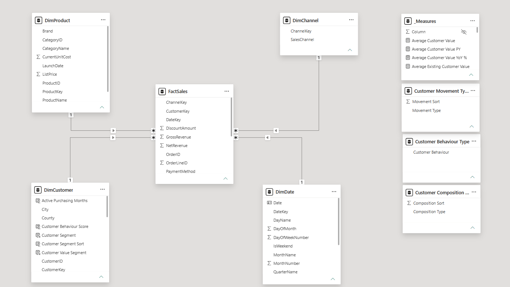

# Customer & Sales Analytics --- Dimensional Model

## 1. Purpose

This document describes the dimensional model developed for the Customer
& Sales Analytics project.

The model was designed to support:

-   sales and profitability analysis;
-   customer behaviour analysis;
-   customer segmentation;
-   customer acquisition analysis;
-   product and category analysis;
-   sales-channel analysis;
-   year-over-year customer movement;
-   efficient Power BI filtering and aggregation.

The analytical model follows a **star schema** design with a central
sales fact table connected directly to four dimensions.

------------------------------------------------------------------------

## 2. Modelling Approach

The analytical layer was intentionally separated from the raw
transactional source.

The final Power BI model contains:

-   `FactSales`
-   `DimCustomer`
-   `DimProduct`
-   `DimDate`
-   `DimChannel`
-   `_Measures`
-   disconnected presentation/helper tables

The core model can be represented as:

``` text
                    DimCustomer
                         |
                         |
DimProduct --------- FactSales --------- DimDate
                         |
                         |
                    DimChannel
```

Each dimension has a one-to-many relationship with `FactSales`.

The model avoids unnecessary dimension-to-dimension relationships and
bidirectional filtering.

------------------------------------------------------------------------

## 3. FactSales

### Purpose

`FactSales` is the central transactional fact table containing completed
commercial transactions used by the primary sales and customer
analytics.

### Grain

> One row per completed order line --- one product purchased by one
> customer as part of one order.

A single order can contain multiple products and therefore multiple fact
rows. `OrderID` must therefore be counted distinctly when calculating
Orders.

### Transaction Scope

Only `OrderStatus = Completed` transactions are loaded into `FactSales`.

Returned and Cancelled transactions remain in the raw layer but are
excluded from primary realised-sales calculations.

### Important Fields

  Field             Purpose
  ----------------- -----------------------------
  DateKey           Relationship to DimDate
  CustomerKey       Relationship to DimCustomer
  ProductKey        Relationship to DimProduct
  ChannelKey        Relationship to DimChannel
  OrderID           Degenerate order identifier
  Quantity          Units sold
  UnitPrice         Transaction selling price
  UnitCost          Transaction unit cost
  DiscountPercent   Applied discount
  GrossRevenue      Revenue before discount
  NetRevenue        Revenue after discount
  TotalCost         Transaction cost
  Profit            Net revenue less total cost

------------------------------------------------------------------------

## 4. Financial Logic

Financial calculations are prepared consistently at the analytical
fact-table level.

``` text
Gross Revenue = Quantity × Unit Price
Net Revenue   = Gross Revenue after applicable discount
Total Cost    = Quantity × Unit Cost
Profit        = Net Revenue - Total Cost
```

Power BI measures aggregate these analytical fields rather than
repeatedly reconstructing transaction arithmetic inside report visuals.

------------------------------------------------------------------------

## 5. DimCustomer

`DimCustomer` contains one row per unique customer.

-   Registered customers: **20,000**
-   Customers with at least one completed purchase: **17,773**

Customers without completed purchasing activity remain valid registered
customers in the dimension.

`CustomerKey` is the analytical key connecting `DimCustomer` to
`FactSales`.

Descriptive attributes support analysis by Customer Type, Registration
Date, City, Region and Country.

------------------------------------------------------------------------

## 6. Customer Analytical Attributes

Customer-level analytical attributes are implemented as **calculated
columns in `DimCustomer`**:

-   First Purchase Date
-   Last Purchase Date
-   First Purchase Year
-   First Purchase Month
-   Lifetime Orders
-   Lifetime Revenue
-   Lifetime Profit
-   Lifetime Purchase Behaviour
-   Active Purchasing Months
-   Purchase Span Days
-   Days Since Last Purchase
-   Value Score
-   Customer Value Segment
-   Frequency Score
-   Frequency Segment
-   Recency Score
-   Recency Segment
-   Customer Behaviour Score
-   Customer Segment
-   Value Segment Sort
-   Frequency Segment Sort
-   Recency Segment Sort
-   Customer Segment Sort

These attributes provide the customer-level foundation for RFV
segmentation and lifetime behavioural analysis.

------------------------------------------------------------------------

## 7. Static vs Dynamic Customer Logic

The model deliberately distinguishes **static customer attributes** from
**dynamic report measures**.

### Static Customer Attributes

Segmentation is based on the complete observed history from **1 January
2022 to 31 December 2025**.

Examples include Lifetime Revenue, Lifetime Orders, Days Since Last
Purchase, Value Segment, Frequency Segment, Recency Segment and Customer
Segment.

These are calculated columns in `DimCustomer`.

### Dynamic Customer Measures

Measures such as New Customers, Existing Customers, Repeat Customers,
Continuing Customers, Returning Existing Customers, Growing Customers,
Stable Customers, Declining Customers and No Longer Purchasing Customers
are evaluated dynamically according to report filter context.

This prevents static lifetime segmentation from being confused with
period-specific customer movement.

------------------------------------------------------------------------

## 8. DimProduct

`DimProduct` contains one row per product.

Validated product population: **500 products**.

It contains descriptive product attributes such as Product ID, Product
Name, Category, Unit Cost and List Price.

------------------------------------------------------------------------

## 9. Category Flattening

The raw source contains separate Product and Category structures.
Category is flattened into `DimProduct` in the analytical model.

Instead of:

``` text
FactSales
    |
DimProduct
    |
DimCategory
```

the model uses:

``` text
FactSales
    |
DimProduct
```

This reduces unnecessary snowflaking and simplifies filtering, DAX
behaviour, model navigation and relationship management.

------------------------------------------------------------------------

## 10. DimDate

`DimDate` provides the controlled calendar dimension for **1 January
2022 to 31 December 2025**.

Validated rows: **1,461**.

Attributes include Date, DateKey, Year, Quarter, Month Number, Month
Name and Year-Month.

`DimDate` is marked as the official Date Table and Power BI Auto
Date/Time is disabled.

------------------------------------------------------------------------

## 11. DimChannel

`DimChannel` contains the four sales channels:

-   Online Store
-   Marketplace
-   Retail Stores
-   Mobile App

`ChannelKey` connects the dimension directly to `FactSales`.

------------------------------------------------------------------------

## 12. OrderID as a Degenerate Dimension

`OrderID` remains directly within `FactSales`.

A separate `DimOrder` table is unnecessary because the project does not
require a substantial collection of descriptive order-level attributes.

`OrderID` therefore acts as a **degenerate dimension** and supports
calculations such as distinct completed Orders.

------------------------------------------------------------------------

## 13. Relationships

  ----------------------------------------------------------------------------------------------------
  From                         To                         Cardinality    Direction      Active
  ---------------------------- -------------------------- -------------- -------------- --------------
  DimCustomer\[CustomerKey\]   FactSales\[CustomerKey\]   1:\*           Single         Yes

  DimProduct\[ProductKey\]     FactSales\[ProductKey\]    1:\*           Single         Yes

  DimChannel\[ChannelKey\]     FactSales\[ChannelKey\]    1:\*           Single         Yes

  DimDate\[DateKey\]           FactSales\[DateKey\]       1:\*           Single         Yes
  ----------------------------------------------------------------------------------------------------

All filters flow **Dimension → Fact**.

No bidirectional relationships are required in the core model.

------------------------------------------------------------------------

## 14. Why Single-Direction Relationships Were Used

Single-direction relationships maintain predictable filter propagation
and reduce ambiguous filter paths, unexpected DAX behaviour and
unnecessary model complexity.

Business interactions between dimensions are analysed through
`FactSales`, preserving the star-schema structure.

------------------------------------------------------------------------

## 15. No Direct Dimension Relationships

The analytical model intentionally avoids direct relationships between
dimensions.

For example, category purchases by Premium Value customers are evaluated
through:

``` text
DimCustomer
      ↓
   FactSales
      ↑
DimProduct
```

This preserves a clean star schema.

------------------------------------------------------------------------

## 16. Analytical Keys

Controlled analytical keys include:

-   CustomerKey
-   ProductKey
-   DateKey
-   ChannelKey

These separate model relationships from descriptive business attributes
and avoid using names as relationship keys.

------------------------------------------------------------------------

## 17. `_Measures` Table

A dedicated `_Measures` table organises Power BI measures and does not
participate in relationships.

Logical measure groups include:

-   Sales
-   Volume
-   Averages
-   Customer Behaviour
-   Customer Growth
-   Time Intelligence
-   Customer Segmentation
-   Customer Trends

This keeps analytical logic separate from physical data columns.

------------------------------------------------------------------------

## 18. Disconnected Helper Tables

Three disconnected **calculated tables** support report presentation:

-   `Customer Behaviour Type`
-   `Customer Composition Type`
-   `Customer Movement Type`

They have no relationships to the star schema.

They provide controlled categories for visuals whose values are
generated dynamically by measures.

------------------------------------------------------------------------

## 19. Why Helper Tables Remain Disconnected

Connecting helper tables to `DimCustomer` or `FactSales` would
incorrectly imply that their labels are physical customer or transaction
attributes.

Keeping them disconnected prevents ambiguous relationships and ensures
that dynamic measures remain responsible for classification.

------------------------------------------------------------------------

## 20. Customer Segmentation Modelling

Customer segmentation uses an RFV-style framework:

-   **Recency** --- Days Since Last Purchase
-   **Frequency** --- Lifetime Orders
-   **Value** --- Lifetime Revenue

Purchasing customers receive quartile scores from 1 to 4. Higher scores
represent stronger performance. For Recency, fewer days since last
purchase produces the stronger score.

Segmentation is calculated across the complete observed 2022--2025
history.

------------------------------------------------------------------------

## 21. Fixed Recency Endpoint

Recency is calculated against **31 December 2025**, rather than
`TODAY()`.

Using `TODAY()` would cause segmentation to change as time passes even
though the transactional dataset ends in 2025.

The fixed endpoint makes the portfolio analysis reproducible and
auditable.

------------------------------------------------------------------------

## 22. Customer Trend Modelling

Customer movement is not stored as a permanent calculated column.

Instead, **measures** compare customer revenue between the current
reporting period and the equivalent previous-year period.

Continuing customers are classified using a ±5% materiality threshold:

-   Growing
-   Stable
-   Declining

Customers with previous-year activity but no current-period completed
purchase are classified as **No Longer Purchasing**.

Customers purchasing again after a gap are classified as **Returning
Existing Customers**.

------------------------------------------------------------------------

## 23. Segmentation vs Customer Movement

Segmentation answers:

> What type of customer is this across the complete observed history?

Customer movement answers:

> How has this customer's purchasing activity changed between reporting
> periods?

A customer can therefore be statically classified as **High-Value
Loyal** while dynamically being classified as **Declining** for a
selected year.

------------------------------------------------------------------------

## 24. Filter Context Design

The star schema provides predictable filter paths:

``` text
Year → DimDate → FactSales
Customer Segment → DimCustomer → FactSales
Category → DimProduct → FactSales
Sales Channel → DimChannel → FactSales
```

This supports cross-analysis such as Premium Value revenue by category,
customer movement by segment and channel performance by year.

------------------------------------------------------------------------

## 25. Segmentation Share Measures and Sort Context

Segment labels use dedicated sort columns to enforce meaningful business
ordering.

Power BI can carry a hidden sort field into grouping context when a
label is sorted by another column.

Share-of-total measures therefore remove filters from both the segment
label and its corresponding sort column when calculating the
denominator.

This ensures the denominator represents the intended complete
population.

------------------------------------------------------------------------

## 26. Model Validation

Validation included:

-   relationship cardinality and direction;
-   orphan-key checks;
-   customer and product counts;
-   date coverage;
-   completed order counts;
-   annual revenue reconciliation;
-   customer segmentation reconciliation;
-   New versus Existing Customer reconciliation;
-   customer movement reconciliation.

Validated core totals:

  KPI                               Result
  ---------------------- -----------------
  Revenue                   £46,028,499.80
  Profit                   Approx. £19.63M
  Profit Margin                     42.66%
  Completed Orders                 169,360
  Purchasing Customers              17,773
  Registered Customers              20,000

These results reconcile between the analytical SQL layer and Power BI.

------------------------------------------------------------------------

## 27. Model Design Principles

### Clear Fact Grain

The fact-table grain was explicitly defined before measure development.

### Star Schema First

Dimensions connect directly to the central fact table.

### Single-Direction Filtering

Core relationships use dimension-to-fact filtering.

### Minimal Snowflaking

Category is flattened into `DimProduct`.

### Controlled Date Intelligence

A dedicated `DimDate` is used and Auto Date/Time is disabled.

### Separate Static and Dynamic Logic

Lifetime segmentation is stored at customer level while period movement
remains measure-driven.

### Dedicated Measures Layer

Business calculations are organised in `_Measures`.

### Disconnected Presentation Tables

Helper categories remain separate from the physical analytical model.

### Reproducible Recency

The recency endpoint matches the end of the available dataset.

### Validation Before Visualisation

Key totals and customer classifications were reconciled before final
report design.

------------------------------------------------------------------------

## 28. Power BI Model

The final Power BI model follows the star-schema structure described
above.



The screenshot provides visual evidence of the central fact table, four
directly connected dimensions, one-to-many relationships, disconnected
helper tables and dedicated `_Measures` table.

------------------------------------------------------------------------

## 29. Data Flow

``` text
Raw CSV Files
      ↓
SQL Raw Layer
      ↓
Data Quality Validation
      ↓
SQL Analytical Layer
      ↓
Star Schema
      ↓
Power BI Semantic Model
      ↓
DAX Measures & Customer Analytics
      ↓
Interactive Power BI Report
      ↓
Business Insights
```

This separation keeps raw data, transformation logic, analytical
modelling and reporting responsibilities clearly defined.

------------------------------------------------------------------------

## 30. Model Outcome

The final dimensional model provides the analytical foundation for the
Customer & Sales Analytics report.

It supports analysis across customers, products, categories, channels,
geography, dates, customer segments, purchasing behaviour and
year-over-year customer movement.

The model demonstrates practical application of:

-   dimensional modelling;
-   star-schema design;
-   SQL analytical preparation;
-   Power BI semantic modelling;
-   DAX;
-   filter-context management;
-   customer analytics.

The result is a model designed not only to report sales totals, but to
support deeper analysis of **who generates value, how customers behave,
what they purchase and how their activity changes over time**.
